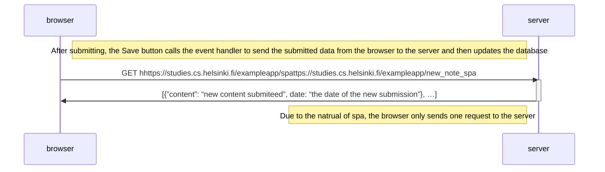

```mermaid
sequenceDiagram
  participant browser
  participant server
  
  Note right of browser: After submitting, the Save button calls the event handler to send the submitted data from the browser to the server and then updates the database
  browser->>server: GET hhttps://studies.cs.helsinki.fi/exampleapp/spattps://studies.cs.helsinki.fi/exampleapp/new_note_spa
  activate server
  server->>browser: [{”content”: “new content submiteed”, date: “the date of the new submission”}, …]
  deactivate server
  Note left of server: Due to the natrual of spa, the browser only sends one request to the server
```
